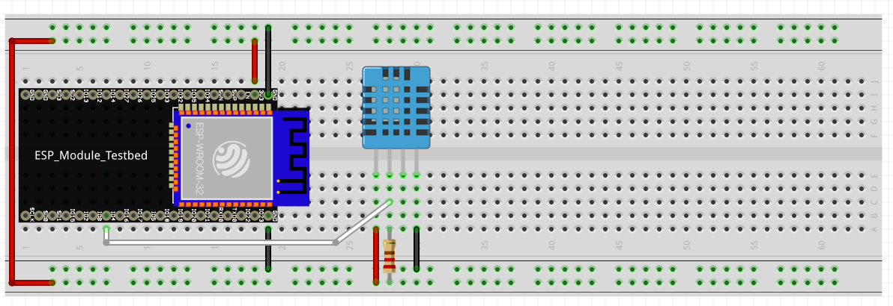

# Cayenne tutorial on LOLIN32
I used LOLIN32 for this project, if you use some other devices just change or add the board to platformio.ini.

Links
* [Cayenne MQTT API][Cayenne MQTT API]
* [Data types][Data types] for Cayenne MQTT API
* [LOLIN32][at WEMOS] at WEMOS
* [LOLIN32][at PlatformIO] at PlatformIO

## Prerequisites
Libraries in PlatformIO
* [Adafruit Unified Sensor][Adafruit Unified Sensor] by Adafruit
* [DHT sensor library][DHT sensor library] by Adafruit

Components
* ESP32 board
* Breadboard
* Cables
* 1x DTH11

Schematics of breadboard

#### Note
The schematics may not be 100% accurate, verify with data sheet for you'r components

##How to use
Start by adding the libraries to PlatformIO in VSCode, then restart VSCode.

The code is configured to send data every 5sek.

Download the code and unzip, open the folder in VSCode. Test to build the code to confirm that the libraries are imported correctly.
* Connect your board to your computer
* In the left tab in VSCode click on The PlatformIO icon.
* Click Devices and copy the address that corresponds to your board (Windows `COMX`, Mac `/dev/cu.xxx`
* Replace the port address on row 18 in platformio.ini
* Then click `Upload and Monitor`

The ESP32 should connect to the Cayenne service if your network credentials are valid.

If there is any errors, check the console for error messages to solve them.

[Cayenne MQTT API]: https://developers.mydevices.com/cayenne/docs/cayenne-mqtt-api/
[Data types]: https://community.mydevices.com/t/data-types-for-cayenne-mqtt-api/3714
[at WEMOS]: https://wiki.wemos.cc/products:lolin32:lolin32
[at PlatformIO]: https://docs.platformio.org/en/latest/boards/espressif32/lolin32.html
[Adafruit Unified Sensor]: https://platformio.org/lib/show/31/Adafruit%20Unified%20Sensor?utm_source=platformio&utm_medium=piohome
[DHT sensor library]: https://platformio.org/lib/show/19/DHT%20sensor%20library?utm_source=platformio&utm_medium=piohome